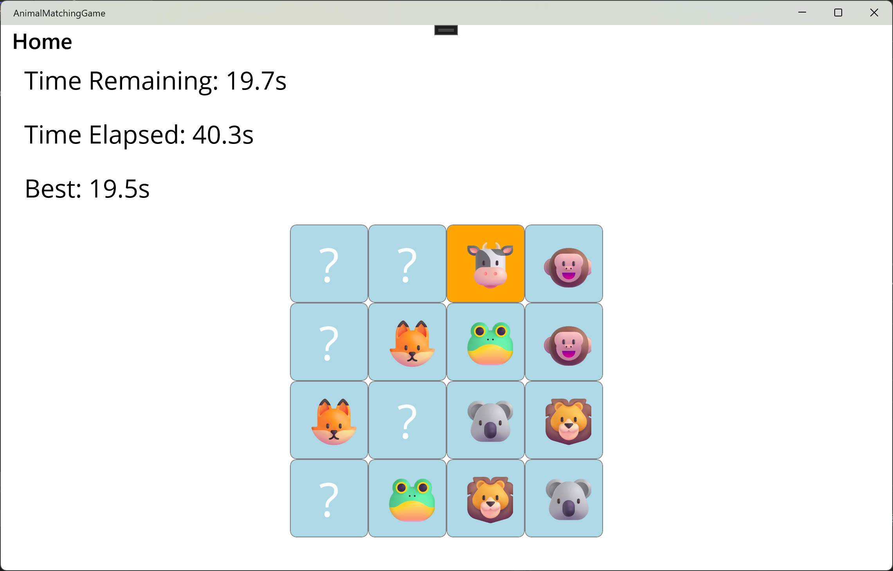
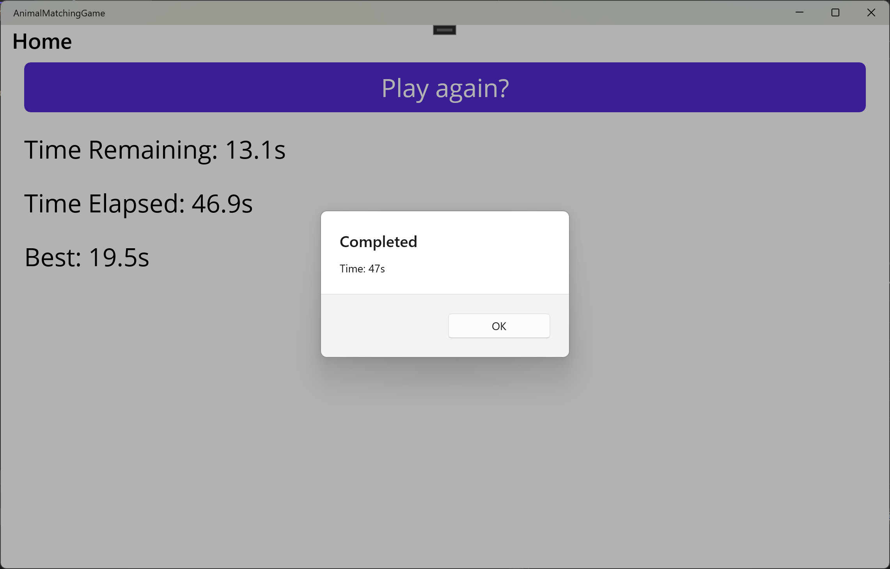

# AnimalMatchingGame (Flip Card)

A MAUI matching game with:
- Flip-card gameplay (card back + reveal)
- Randomized animal sets per round
- Countdown timer (time limit)
- Best time record (local persistence)

## How to run
Open the solution in Visual Studio and run the MAUI project.

## Gameplay
1. Click **Play again** to start a new round.
2. All cards are shown face down ("?").
3. Click two cards to flip them.
4. If the animals match, the cards remain cleared.
5. If they do not match, the cards flip back after a short delay.
6. Match all pairs before the countdown timer reaches zero to win.

## Game Rules
- The game is completed when all pairs are matched.
- The game fails if the countdown timer reaches zero.
- Completion time is recorded if the game is successfully finished.

## Technical Highlights
- Built with **.NET MAUI**
- Event-driven UI using Button Click handlers
- Flip-card logic implemented via state tracking
- Countdown timer using `Dispatcher.StartTimer`
- Best time persisted locally using `Preferences`
- Randomized animal sets per game session

## State Management
The game state is controlled by:
- Current flipped card reference
- Matching state (first / second card)
- Matched pair count
- Timer running state

This ensures consistent behavior and prevents invalid interactions
such as double-clicking during card resolution.

## Future Improvements
- Flip animation using MAUI animations
- Difficulty levels (more cards, shorter time limit)
- Global leaderboard
- Sound effects and visual feedback
- Mobile-friendly layout optimizations

## Screenshots

## Notes
Best time is stored using Preferences.
